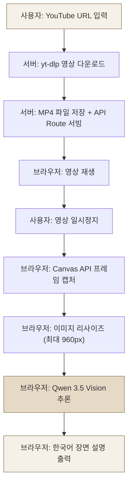
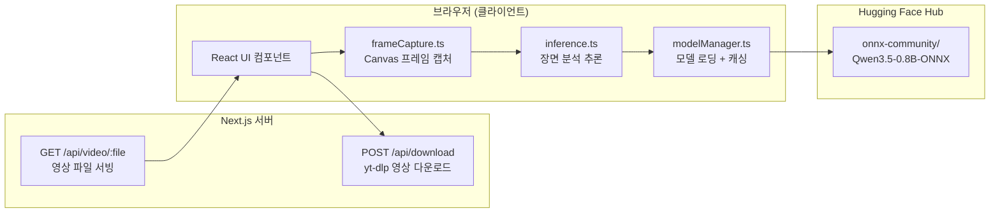

# Video Scene Description using Qwen Vision-Language Model

WebGPU 기반 Vision-Language 모델을 활용한 영상 장면 분석 프로젝트입니다.

이 프로젝트는 YouTube 영상의 특정 프레임을 캡처하고, 브라우저에서 직접 실행되는 AI 모델로 장면을 분석하여 자연스러운 한국어 설명을 생성합니다.

**모든 AI 추론은 브라우저에서 실행되며, 외부 AI API를 사용하지 않습니다.**

---

## 프로젝트 개요

| 항목 | 내용 |
|------|------|
| 프로젝트 유형 | On-Device Video Frame Analysis |
| 프론트엔드 | Next.js 15 (App Router) |
| AI 모델 | Qwen 3.5 Vision 0.8B (ONNX) |
| 추론 런타임 | Transformers.js 4.0 |
| GPU 가속 | WebGPU (WASM 자동 폴백) |
| 영상 다운로드 | yt-dlp (서버 측) |
| 프레임 캡처 | Canvas API |
| 출력 언어 | 한국어 |

### 핵심 목표

- **On-Device 추론**: 외부 서버나 API 없이 브라우저 내에서 Vision-Language 모델을 직접 실행
- **WebGPU 가속**: 브라우저의 GPU를 활용하여 모델 추론 속도를 향상
- **한국어 출력**: 영상 장면 분석 결과를 자연스러운 한국어로 생성

---

## 주요 기능

- **YouTube 영상 다운로드**: URL 입력 → yt-dlp로 최대 1080p H.264 MP4 다운로드
- **브라우저 영상 재생**: 다운로드된 영상을 웹 플레이어에서 재생 (Range Request 지원)
- **프레임 단위 탐색**: 이전/다음 프레임 이동 버튼 (1/30초 단위)
- **프레임 캡처**: Canvas API로 현재 영상 프레임을 원본 해상도로 캡처
- **AI 장면 분석**: Qwen 3.5 Vision 모델로 캡처된 프레임을 분석
- **한국어 장면 설명**: 분석 결과를 한국어로 생성
- **WebGPU 자동 감지**: WebGPU 사용 가능 시 GPU 가속, 불가능 시 WASM 자동 폴백
- **추론 설정 조절**: Temperature, Max Tokens 등 생성 파라미터 UI에서 조절 가능
- **모델 캐싱**: 첫 다운로드 후 브라우저 Cache API에 자동 저장 (재방문 시 즉시 로드)

---

## 시스템 아키텍처

### 동작 흐름



### 모듈 구조



---

## 기술 스택

| 분류 | 기술 | 버전 | 역할 |
|------|------|------|------|
| 프레임워크 | Next.js | 15.2 | App Router, API Routes, 서버 사이드 로직 |
| 런타임 | React | 19.0 | 클라이언트 UI |
| AI 추론 | Transformers.js | 4.0.0-next.8 | 브라우저 ONNX 모델 로딩 및 추론 |
| AI 모델 | Qwen 3.5 Vision 0.8B | ONNX q4f16 | 이미지 분석 + 한국어 생성 |
| GPU 가속 | WebGPU | — | 브라우저 GPU 연산 |
| 스타일링 | Tailwind CSS | 4.0 | UI 스타일링 |
| 타입 시스템 | TypeScript | 5.7 | 정적 타입 검사 |
| 영상 다운로드 | yt-dlp | 시스템 설치 | YouTube 영상 다운로드 |

---

## 프로젝트 구조

```
├── src/
│   ├── app/
│   │   ├── layout.tsx              # 루트 레이아웃
│   │   ├── page.tsx                # 메인 페이지 (전체 UI 상태 관리)
│   │   ├── globals.css             # 글로벌 CSS 변수 + 테마
│   │   └── api/
│   │       ├── download/
│   │       │   └── route.ts        # YouTube 다운로드 API (yt-dlp)
│   │       └── video/
│   │           └── [filename]/
│   │               └── route.ts    # 영상 파일 서빙 API (Range Request)
│   ├── components/
│   │   ├── Header.tsx              # 상단 헤더 (모델/GPU 상태 표시)
│   │   ├── ModelLoader.tsx         # 모델 로드 버튼 + 진행률
│   │   ├── VideoPlayer.tsx         # 영상 플레이어 + 프레임 캡처
│   │   └── AnalysisPanel.tsx       # 분석 결과 + 프롬프트 + 설정
│   ├── lib/
│   │   ├── modelManager.ts         # 모델 싱글톤 로딩, WebGPU 감지, 캐싱
│   │   ├── inference.ts            # 프레임 분석 추론 파이프라인
│   │   └── frameCapture.ts         # Canvas 프레임 캡처 유틸리티
│   └── middleware.ts               # COOP/COEP 헤더 (Cross-Origin Isolation)
├── videos/                         # 다운로드된 영상 (gitignore)
├── next.config.mjs                 # Next.js 설정 (Webpack, COOP/COEP)
├── package.json
├── tsconfig.json
└── README.md
```

---

## 설치 및 실행

### 사전 요구사항

| 요구사항 | 버전 | 확인 방법 |
|----------|------|-----------|
| Node.js | 18 이상 | `node --version` |
| npm | 9 이상 | `npm --version` |
| yt-dlp | 최신 | `yt-dlp --version` |
| ffmpeg | 최신 (yt-dlp 영상 병합용) | `ffmpeg -version` |
| 브라우저 | Chrome 113+ 또는 Edge 113+ | WebGPU 지원 필수 |

### yt-dlp 설치

```bash
# macOS (Homebrew)
brew install yt-dlp ffmpeg

# 또는 pip
pip install yt-dlp
```

### 프로젝트 설치 및 실행

```bash
# 1. 저장소 클론
git clone https://github.com/<사용자>/<저장소>.git
cd <저장소>

# 2. 의존성 설치
npm install

# 3. 개발 서버 실행
npm run dev

# 4. 브라우저에서 접속
#    반드시 localhost로 접속해야 합니다 (127.0.0.1 불가)
open http://localhost:3000
```

> **중요**: 반드시 `http://localhost:3000`으로 접속하세요. `127.0.0.1`이나 LAN IP로 접속하면 Cross-Origin Isolation이 작동하지 않아 WebGPU 추론이 제한됩니다.

### 빌드 및 프로덕션 실행

```bash
npm run build
npm run start
```

---

## 사용 방법

### 1. 모델 로드

페이지 상단의 **"모델 로드"** 버튼을 클릭합니다.

- 첫 방문 시 Hugging Face Hub에서 모델 파일(~646MB)을 다운로드합니다.
- 다운로드된 파일은 브라우저 Cache API에 자동 저장됩니다.
- 이후 방문 시 캐시에서 즉시 로드됩니다.

### 2. 영상 다운로드

YouTube URL을 입력하고 **"영상 다운로드"** 버튼을 클릭합니다.

- 서버에서 yt-dlp를 사용하여 최대 1080p H.264 MP4를 다운로드합니다.
- 다운로드 완료 후 영상이 플레이어에 자동으로 로드됩니다.

### 3. 프레임 분석

1. 영상을 원하는 장면에서 **일시정지**합니다.
2. **"프레임 분석"** 버튼을 클릭합니다.
3. 현재 프레임이 캡처되고 AI 모델이 분석을 시작합니다.
4. 한국어 장면 설명이 오른쪽 패널에 표시됩니다.

### 4. 설정 조절 (선택)

**"추론 설정 보기"** 를 클릭하여 생성 파라미터를 조절할 수 있습니다:

| 파라미터 | 기본값 | 설명 |
|----------|--------|------|
| Temperature | 0.2 | 낮을수록 안정적이고 사실적인 설명 |
| Max Tokens | 80 | 생성되는 최대 토큰 수 |

---

## AI 모델 상세

### Qwen 3.5 Vision 0.8B

| 항목 | 내용 |
|------|------|
| 모델 ID | `onnx-community/Qwen3.5-0.8B-ONNX` |
| 파라미터 수 | 약 8억 (0.8B) |
| 양자화 | q4f16 (4비트 가중치 + 16비트 활성화) |
| 다운로드 크기 | 약 646MB |
| 구성 요소 | vision_encoder + embed_tokens + decoder_model_merged |
| 한국어 지원 | 네이티브 지원 |
| 입력 | 이미지 + 텍스트 프롬프트 |
| 출력 | 텍스트 (한국어 장면 설명) |

### 모델 선택 근거

Qwen 3.5 Vision 0.8B를 선택한 이유:

- **브라우저 호환성**: ONNX 형식으로 제공되며 Transformers.js 4.0에서 `Qwen3_5ForConditionalGeneration` 클래스 지원
- **크기 효율성**: q4f16 양자화로 ~646MB, 브라우저 메모리 제한 내에서 안정적 실행
- **한국어 지원**: Qwen 모델 계열의 다국어 학습으로 네이티브 한국어 생성 가능
- **비전-언어 통합**: 이미지 인코더 + 텍스트 디코더 통합 아키텍처

> **참고**: `@huggingface/transformers` v3.8.1에서는 `qwen3_5` 모델 타입이 지원되지 않아 `4.0.0-next.8` 이상이 필요합니다.

### 추론 파이프라인

```
1. 프레임 캡처 (Canvas API, 원본 해상도 PNG)
   ↓
2. 이미지 리사이즈 (최대 960px, 추론 속도 최적화)
   ↓
3. 채팅 메시지 구성 (이미지 + 한국어 프롬프트)
   ↓
4. 프로세서 처리 (토큰화 + 비전 인코딩)
   ↓
5. 모델 생성 (max_tokens=80, temp=0.2, top_p=0.9)
   ↓
6. 토큰 디코딩 → 한국어 장면 설명 출력
```

### WebGPU vs WASM

| 항목 | WebGPU | WASM 폴백 |
|------|--------|-----------|
| 실행 위치 | GPU | CPU |
| 속도 | 빠름 | 느림 |
| 요구사항 | Chrome 113+ / Edge 113+ | 모든 모던 브라우저 |
| 자동 선택 | WebGPU 가능 시 우선 사용 | WebGPU 실패 시 자동 전환 |

---

## Cross-Origin Isolation

이 프로젝트는 `SharedArrayBuffer`를 사용하기 위해 Cross-Origin Isolation을 활성화합니다.

### 설정된 HTTP 헤더

| 헤더 | 값 | 목적 |
|------|------|------|
| Cross-Origin-Opener-Policy | same-origin | 브라우징 컨텍스트 격리 |
| Cross-Origin-Embedder-Policy | require-corp | 모든 서브리소스에 CORS/CORP 요구 |

### 적용 방식

- `src/middleware.ts`: 모든 요청에 COOP/COEP 헤더 설정 (주요 메커니즘)
- `next.config.mjs`: `headers()` 함수로 동일 헤더 설정 (보조)
- `next.config.mjs`: `crossOrigin: "anonymous"` 설정으로 모든 `<script>` 태그에 CORS 모드 적용

> **주의**: `http://localhost`로만 접속해야 합니다. 다른 호스트명(127.0.0.1, 192.168.x.x 등)은 COOP 헤더가 무시됩니다.

---

## 문제 해결

### .next 캐시 오류

```
Cannot find module './873.js'
ENOENT: no such file or directory, stat '.next/cache/webpack/...'
```

```bash
# .next 캐시를 삭제하고 재빌드
npm run dev:clean
```

### yt-dlp 403 오류

YouTube CDN에서 403 Forbidden 응답이 발생할 수 있습니다. yt-dlp를 최신 버전으로 업데이트하세요:

```bash
brew upgrade yt-dlp
# 또는
pip install -U yt-dlp
```

### WebGPU 미지원

- Chrome 113 이상 또는 Edge 113 이상을 사용하세요.
- `chrome://flags`에서 WebGPU 관련 플래그가 활성화되어 있는지 확인하세요.
- WebGPU를 지원하지 않는 환경에서는 WASM으로 자동 폴백됩니다.

### CrossOriginIsolated 비활성

- 반드시 `http://localhost:3000`으로 접속하세요.
- `http://127.0.0.1:3000`이나 LAN IP는 작동하지 않습니다.
- 브라우저 개발자 도구 콘솔에서 `self.crossOriginIsolated`을 확인할 수 있습니다.

### 모델 로딩 메모리 오류

```
RangeError: Array buffer allocation failed
```

- 다른 탭을 닫아 브라우저 메모리를 확보하세요.
- q4f16 양자화 모델은 약 646MB의 메모리를 사용합니다.

---

## npm 스크립트

| 명령어 | 설명 |
|--------|------|
| `npm run dev` | 개발 서버 실행 (localhost 바인딩) |
| `npm run dev:clean` | .next 캐시 삭제 후 개발 서버 실행 |
| `npm run build` | 프로덕션 빌드 |
| `npm run start` | 프로덕션 서버 실행 |
| `npm run clean` | .next 캐시만 삭제 |

---

## 브라우저 호환성

| 브라우저 | WebGPU | 상태 |
|----------|--------|------|
| Chrome 113+ | O | 권장 |
| Edge 113+ | O | 권장 |
| Firefox | X | WASM 폴백으로 실행 가능 |
| Safari 18+ | △ | 부분 지원 |

---

## 라이선스

이 프로젝트는 학술 목적으로 제작되었습니다.
